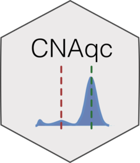

```{r, include = FALSE}
knitr::opts_chunk$set(
  collapse = TRUE,
  comment = "#>",
  fig.path = "man/figures/README-",
  out.width = "100%"
)
```

# CNAqc 

<!-- badges: start -->

[](https://travis-ci.org/caravagn/CNAqc)
[](https://www.tidyverse.org/lifecycle/#maturing)
[](https://caravagn.github.io/evoverse)
<!-- badges: end -->

`CNAqc` is a package to provide a set of metrics to assess the quality of 
Copy Number Alteration (CNA) calls, and determine reliable estimates of 
mutations' Cancer Cell Franctions (CCFs).

`CNAqc` is part of the `evoverse`, a package that gathers multiple R packages to implement 
Cancer Evolution analyses; see more [about evoverse](https://caravagn.github.io/evoverse).

The package provides statistical measures to quantify the concordance 
between mutation and Copy Number calls, exploiting allelic imbalance in absolute CNA segments and allelic frequencies 
of somatic mutations. Quantitative metrics and plots for data 
exploration and quality check are available, allowing for a intuitive
assessment of the quality of calls. Quantitative measures can also be 
used to suggest adjustemnts of the current purity estimates to increase
the quality of CNA calls, and to determine determine CCF values.

#### Statistical models

For QC of the CNA calls `CNAqc` implements a linear score where the relative size of each of a
set of karyotypes is used to weight the offset between an estimated
peak in the data, and its expectation. The expectations are determined
by standard CNA computations accouting for normal plodiy, tumour purity
and tumor ploidy. The peaks are determined after a KDE of the data, run
through a dedicated peak-detection package.

To determine CCF of the input mutations `CNAqc` uses an entropy-based measure that
allows to tune a heuristic for the estimation of the number of copies of each mutation.
In turn, this quantity allows one estimating the CCF as the adjustment for tumour purity,
segment ploidy and mutation multiplicity. These set of routines can be used to determine
high-confidence CCF estimates and filter out those set of mutations for which it is generally 
difficult to determine mutation multiplicities and CCF values.

#### Help and support

[](https://caravagn.github.io/CNAqc)
-----

### Installation

You can install the released version of `CNAqc` from
[GitHub](https://github.com/) with:

``` r
# install.packages("devtools")
devtools::install_github("caravagn/CNAqc")
```

-----

#### Copyright and contacts

Giulio Caravagna, PhD. _Institute of Cancer Research, London, UK_.

[](mailto:gcaravagn@gmail.com)
[](https://github.com/caravagn)
[](https://twitter.com/gcaravagna)
[](https://sites.google.com/site/giuliocaravagna/)
