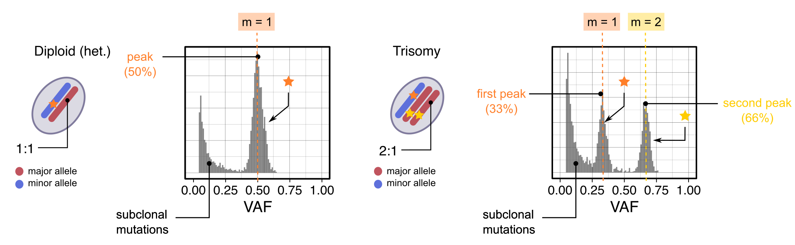

```{r, include = FALSE}
knitr::opts_chunk$set(
  collapse = TRUE,
  comment = "#>"
)

options(crayon.enabled=F)
```

# Overview

<br>
_CNAqc Input/Output_


## Summary

CNAqc requires in input

* read counts from somatic mutations such as single-nucleotide variants (SNVs) or insertion-deletions (indels); 
* allele-specific copy number segments (CNAs) for clonal segments and, optionally, for subclonal segments;
* a tumor purity estimate.

CNAqc uses chromosome coordinates the to map mutations to segments. The conversion of relative to absolute genome coordinates requires to fix a reference genome build; supported references are GRCh38/hg17 and hg19/GRCh37, but custom references can also be built. 

The tool can elaborate a number of analysis to assess the consistency among mutations, CNAs and tumour purity (see Articles). 

CNAqc can be used to: 

1. QC concordance across the input mutations, CNAs and purity;
2. select among alternative tumour segmentations and purity/ ploidy estimates;
3. optimize CNA calling with automatic QC procedures leveraging the Sequenza copy number caller;
4. estimate CCF values of the input variants, and estimate their uncertainty;
5. identify patterns of over-fragmentation of chromosome arms;
6. smooth and subset segments with various filters;
7. annotate putative driver mutations among the input variants, using [VariantAnnotation](https://bioconductor.org/packages/release/bioc/html/VariantAnnotation.html).

## The model


The following concepts are used to develop CNAqc.

### VAF peaks

<br>
_Expected VAF peaks for mutations mapped to diploid heterozygous and triploid clonal CNAs (at purity $\pi=1$)._


### Clonal CNAs

Consider:

- mutations present in a percentage $0<c<1$ of tumour cells, sitting on a segment $nA:nB$;
- tumour purity $\pi$;
- a healthy diploid normal;

Since the proportion of all reads from the tumour is $\pi(n_A+n_B)$, and from the normal is $2(1-\pi)$. Then, muations present in $m$ copies of the tumour genome should peak at VAF value 
\[
v_m(c) = \dfrac{m \pi c}{
2 (1 - \pi) + \pi (n_A+n_B)
} \, .
\]

### Subclonal CNAs

Consider a mixture of 2 subclones with segments $n_{A,1}:n_{B,1}$ and  $n_{A,2}:n_{B,2}$, proportions $\rho_1$ and $\rho_2$ ($\rho_1+\rho_2=1$).

The expected peak for a shared mutation with multiplicity $m_1$/ $m_2$ in the first/ second subclone is
\[
v_{m_1,m_2} = \dfrac{
(m_1\rho_1 + m_2\rho_2) \pi
}
{
2 (1 - \pi) + \pi [(n_{A,1}+n_{B,1})\rho_1 + (n_{A,2}+n_{B,2})\rho_2]
} \, .
\]

The expected peak for a private mutation with multiplicity $m$ in subclone $i$ is
\[
v_{m_i} = \dfrac{
m\rho_i \pi
}
{
2 (1 - \pi) + \pi [(n_{A,1}+n_{B,1})\rho_1 + (n_{A,2}+n_{B,2})\rho_2]
} \, .
\]


### Cancer Cell Fractions (CCFs)

Given VAF, tumour purity and CNAs, CCF  values can be computed as


\[
c = 
\dfrac{
v[
(n_a+n_B - 2)\pi + 2
]
}
{
m \pi
}
\]

Therefore the problem of computing CCFs is essentially linked to computing `m`, mutation multiplicity. This type of computation can be done by "phasing" the VAFs against the multiplicity.

