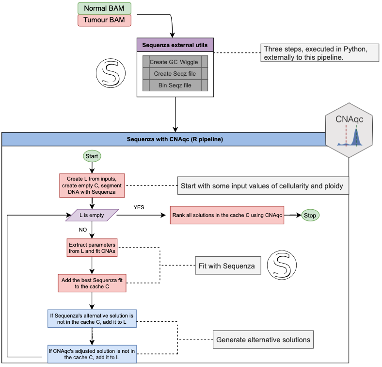

```{r, include = FALSE}
knitr::opts_chunk$set(
  collapse = TRUE,
  comment = "#>"
)

options(crayon.enabled=FALSE)
```

# Iterative CNA calling and QC

We are happy to integrate any copy number caller with CNAqc; do [get in touch](gcaravagn@units.it) to discuss how to integrate your caller.

## Sequenza tool

CNAqc provides automatic integration with [Sequenza](https://cran.r-project.org/web/packages/sequenza/vignettes/sequenza.html) 

- Favero F, Joshi T, Marquard AM, Birkbak NJ, Krzystanek M, Li Q, Szallasi Z, Eklund AC "Sequenza: allele-specific copy number and mutation profiles from tumor sequencing data." Annals of Oncology 2015 Jan;26(1):64-70. https://doi.org/10.1093/annonc/mdu479

Sequenza calls _clonal_ CNAs in a multi-steps Python/R pipeline:

1. process a FASTA file to produce a GC Wiggle track file; 
2. process tumour and normal BAMs and Wiggle files to produce a `seqz` file;
3. bins the original `seqz` file; 
4. process the binned `seqz` for normalisation and segmentation;
5. perform a grid-search approach to estimate _cellularity_ and _ploidy_;

One advantage of Sequenza is that results are computed for both the best and possible alternative solutions.

Here cellularity is the Sequenza terminology for tumour purity; steps 1-3 are implemented in Python, while steps 4-6 in R. In our experience we have often found the steps 1-3 to be run just once (often with default parameter values), while the last steps are iterated to optimise CNA calling.

We have implemented a  calling pipeline (function `Sequenza_CNAqc`) that revolves around steps 4-6, using CNAqc to drive the fitting steps of Sequenza - especially step 5 - to determine better CNA segments and purity/ploidy values. To run this pipeline steps 1-3 need to be executed beforehand; according to the [Sequenza](https://cran.r-project.org/web/packages/sequenza/vignettes/sequenza.html) documentation the default execution is as follows.

```{}
# Process a FASTA file to produce a GC Wiggle track file:
sequenza−utils gc_wiggle −w 50 --fasta hg19.fa -o hg19.gc50Base.wig.gz

# Process BAM and Wiggle files to produce a seqz file:
sequenza−utils bam2seqz -n normal.bam -t tumor.bam --fasta hg19.fa \
    -gc hg19.gc50Base.wig.gz -o out.seqz.gz
    
# Post-process by binning the original seqz file:
sequenza−utils seqz_binning --seqz out.seqz.gz -w 50 -o out small.seqz.gz
```

## Pipeline




The pipeline starts from input ranges for cellularity and ploidy values, as canonically required by Sequenza. 

Parameters for segmentation are also imputed following the standard Sequenza convention, and step 4 is performed once before starting an iterative procedure that uses a caching system to avoid useless repetitions of computations. Default Sequenza parameter values we release with CNAqc have been delected to work best with whole-genome sequencing data, a type of data we often use to run this pipeline.

The pipeline fits (Sequenza steps 5-6) cellularity and ploidy values, and dumps results, which are quality controlled by peak detection via CNAqc. The analysis with CNAqc can be carried out using either:

- somatic mutations called by Sequenza, 
- or an external set of input calls. We often prefer this option, if possibile, and take, e.g., [Mutect2](https://gatk.broadinstitute.org/hc/en-us/articles/360037593851-Mutect2) calls.

Besides the best solution by Sequenza, at every run up to two alternative solutions are generated:

1. One optional by Sequenza, which might propose new exact values for cellularity and ploidy that differ from the current best ones;
2. One by CNAqc, adjusting the current cellularity of the best Sequenza solution, leaving the ploidy unchanged.

These alternative solutions are queued in a list $L$ of cellularity and ploidy values that should be tested, based on their presence in a cache (the cache avoids to re-test solutions already visited). Until the list $L$ is empty, the point values of cellularity and ploidy are tested repeating steps 5-6 with small ranges built around the proposed values. For example, if a solution with cellularity $34\%$ and ploidy $2.5$ is to  be tested, CNAqc runs Sequenza by using ranges $[34\%-d;34\%+d]$ and $[2.5-c;2.5+c]$, where $c$ and $d$ are parameters of the pipeline. 

Therefore the pipeline follows two paths to optimise the calls:

- the gradient of correction suggested by CNAqc, 
- Sequenza’s alternative solutions. 

Note that when CNAqc flags as PASS a solution that is visited for the first time, any further correction will not be evaluated since the solution will be found in the cache system of the pipeline. 

At the end of the runs all the solutions identified are scored by CNAqc and reported with a PASS/FAIL status associated; the pipeline always indicates the best among the tested ones, based on the assigned quality score.


